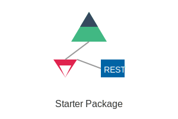

# NUXT + NEST + POSTGRES Starter Templete


## Key Feature
- Authentication Role Base Guard
- Buildin Admin can be extends easly 
- Docker File can be start in one minute without any config
- Can be test easy from backend to fronted 
## Get Start 
### Installation

Node js and Docker is required 
```
cd admin
npm i 
```

```
cd api 
npm i
```
### Start the project 
```
Docker composer 
```

